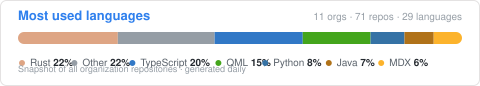

<div align="right">
  <em>
    <strong>X</strong>
  </em> scriptor
</div>


```javascript
const Xscriptor = {
  user: "xscriptor",
  lang: ["TypeScript", "JavaScript", "Rust", "Java", "Python", "CSS", "Bash", "PWS"],
  Sokernel: ["X", "Linux", "Macos", "Windows"],
  projects: [
    "xlnux",
    "gitnapse",
    "xfetch-cli",
    "xwebanalysis",
    "xscriptor-colors",
    "xscriptor-web",
    "xscriptor-legacy",
    "xscriptor-ai"
  ]
};
```

<em><strong>Craft over noise</strong></em>

<div align="center">
  <a href="https://xscriptor.com">writer</a> ·
  <a href="https://xscriptor.io">developer</a> ·
  <a href="https://xscriptor-colors.github.io/web/">colors</a> ·
  <a href="https://xfetch-cli.github.io/web/">xfetch-cli</a> ·
  <a href="https://xtop-cli.github.io/web/">xtop-cli</a>
</div>

<div align="center">
  
</div>

<div align="center">
  
</div>

<div align="center">
  
</div>
